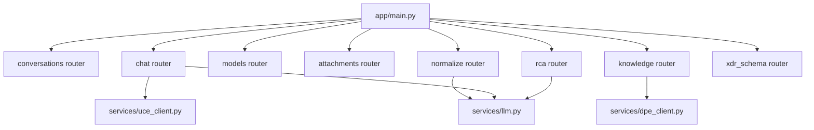
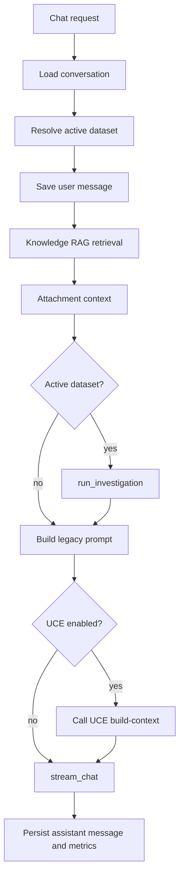

# Backend Architecture

## Purpose

The backend is the central orchestration layer for ReasonDock. It exposes REST/SSE APIs, owns application persistence, coordinates engines, and performs the final LLM call.

## Responsibilities

- conversation CRUD and message persistence
- streaming chat endpoint
- legacy RAG retrieval through `vector_store`
- knowledge document upload and document IR management
- UCE and DPE HTTP client integration
- xDR dataset upload, registry, and conversation binding
- QIE query planning and DuckDB execution orchestration
- RCA job lifecycle and SSE progress stream
- model adapter access through `services/llm.py`

## Current Implementation

Primary backend entrypoint:

- `backend/app/main.py`

Registered routers:

- `routes/conversations.py`
- `routes/chat.py`
- `routes/models.py`
- `routes/attachments.py`
- `routes/knowledge.py`
- `routes/rca.py`
- `routes/normalize.py`
- `routes/xdr_schema.py`

The backend creates SQLAlchemy tables on startup and performs additive MySQL column checks in `_ensure_longtext_columns`.



## Internal Pipeline

### Chat Endpoint

`POST /api/conversations/{conversation_id}/chat` performs:

1. load conversation, messages, attachments
2. resolve active xDR dataset from request `dataset_id` or conversation primary binding
3. persist the user message
4. run legacy knowledge RAG retrieval
5. include attachment text
6. run QIE if an active dataset exists
7. assemble legacy system prompt
8. optionally call UCE `/build-context`
9. call `stream_chat()` through `services/llm.py`
10. persist assistant response and debug metrics



### Knowledge Endpoint

Knowledge uploads are parsed and chunked first. DPE analysis is currently a separate manual action.

```mermaid
graph TD
  Upload[/api/knowledge/upload] --> Extract[file_parser.extract_text]
  Extract --> Chunk[chunker.split_text]
  Chunk --> Index[vector_store.add_chunks]
  Extract --> Summary[generate_summary]
  Summary --> Ready[KnowledgeDocument ready RAW_ONLY]
  Ready --> Analyze[/api/knowledge/{id}/analyze]
  Analyze --> DPE[DPE /process]
  DPE --> StoreIR[normalized_content and uce_denoised_content]
```

### RCA and Dataset Endpoints

`routes/rca.py` contains both legacy RCA job APIs and dataset management APIs:

- `/api/rca/jobs`
- `/api/rca/jobs/{id}/stream`
- `/api/rca/datasets`
- `/api/rca/datasets/{dataset_id}`
- `/api/rca/conversations/{conversation_id}/datasets`

## External Interactions

| Target | Method | Used by |
|---|---|---|
| MySQL | SQLAlchemy async | conversation, message, knowledge, schema, RCA metadata |
| DuckDB | sync calls via QIE `duckdb_store`; async via `asyncio.to_thread()` | xDR dataset storage and querying |
| UCE | HTTP `/build-context` | chat and RCA prompt optimization |
| DPE | HTTP `/process` | knowledge DPE IR generation |
| LLM providers | `services/llm.py` adapters | chat, titles, summaries, normalization, planner, RCA |

## Important Design Decisions

- Backend owns persistence; UCE and DPE are stateless.
- xDR datasets are never globally selected by fallback in chat; the active dataset must come from request selection or conversation binding.
- Structured investigation debug metadata is attached to message `metrics`.
- `services/llm.py` is the only general LLM access path for backend code.

## In-Progress Refactoring

- QIE code is moving out of RCA-specific modules, but route ownership remains under backend.
- xDR schema registry is implemented as backend API while conceptually serving QIE.
- Legacy RAG and UCE document flow coexist.

## Future Direction

- Move more QIE lifecycle code out of `routes/rca.py` into QIE service modules.
- Keep chat routing explicit: general chat, document-grounded chat, xDR investigation, RCA specialization.
- Strengthen direct-render paths so simple aggregations avoid final LLM calls.

