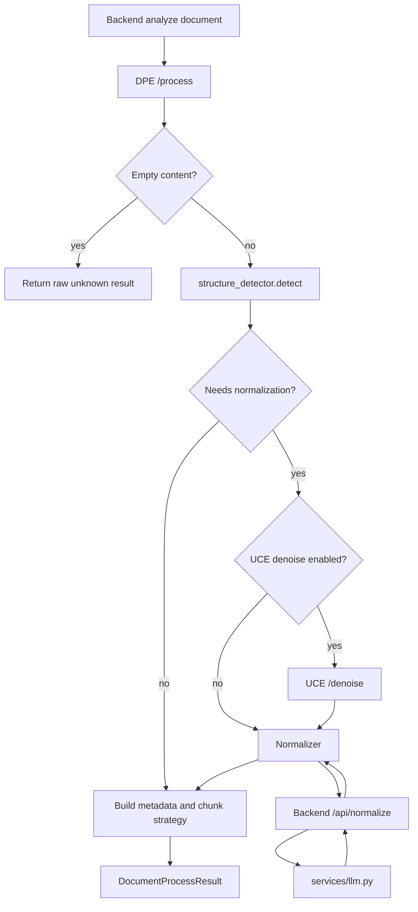

# DPE Architecture

## Purpose

DPE, the Document Processing Engine, is ReasonDock's upload-time document preprocessing service. It detects structure, optionally denoises and normalizes unstructured text, and returns retrieval-friendly document IR for the backend to store.

DPE exists so UCE can receive documents that look more like structured markdown at query time.

## Responsibilities

- receive already extracted text from backend
- detect structure type and confidence
- decide whether normalization should run
- optionally call UCE `/denoise`
- call backend `/api/normalize` for LLM-based normalization
- return normalized content, content type, chunk strategy, and retrieval hints

DPE does not:

- own files or database records
- answer user questions
- directly call the final answer LLM
- perform vector search

## Current Implementation

Service endpoints:

- `POST /process`
- `GET /health`
- `GET /status`

Core files:

- `dpe/app/core/processor.py`
- `dpe/app/core/structure_detector.py`
- `dpe/app/core/normalizer.py`
- `dpe/app/adapters/backend_client.py`
- `dpe/app/adapters/uce_client.py`

Backend integration:

- `backend/app/services/dpe_client.py`
- `backend/app/routes/knowledge.py`
- `backend/app/routes/normalize.py`

Current knowledge flow uploads raw text first and stores `RAW_ONLY`; DPE IR is generated through manual `/api/knowledge/{doc_id}/analyze`.

## Pipeline

## Internal Pipeline

## Normalization Decision

Normalization runs only when:

- request options enable normalization
- structure confidence is at or below the configured threshold
- structure type is one of `plain_text`, `mixed`, `unknown`, `log`
- content is within `DPE_NORMALIZATION_MAX_CHARS`

The result includes:

- `normalized_content`
- `structure_type`
- `structure_confidence`
- `chunk_strategy`
- `normalization_applied`
- `normalization_model`
- `normalization_skipped_reason`
- `retrieval_hints`
- `content_type`
- optional `denoised_content`

## External Interactions

| Interaction | Direction | Purpose |
|---|---|---|
| Backend `/api/knowledge/{id}/analyze` to DPE `/process` | backend to DPE | generate DPE IR |
| DPE to backend `/api/normalize` | DPE to backend | LLM normalization through backend |
| DPE to UCE `/denoise` | DPE to UCE | optional semantic denoising before normalization |

## Important Design Decisions

- DPE receives extracted text; it does not parse binary files itself in the observed backend path.
- DPE never calls the provider LLM directly. Normalization is delegated to backend `/api/normalize`.
- DPE does not own persistence; backend stores IR and metadata.
- Normalization is skipped for high-confidence structured content and oversized content.
- Generated IR is meant for retrieval structure, not summary or answer generation.

## Current Implementation Status

- DPE service and Docker Compose service exist.
- Structure detection, normalization decision, backend normalize client, and optional UCE denoise call exist.
- Backend stores DPE output in `KnowledgeDocument.normalized_content`, `uce_denoised_content`, `dpe_metadata`, and `dpe_ir_status`.
- Automatic DPE execution at upload time is not the current knowledge upload path; upload and DPE analysis are separate actions.

## In-Progress Refactoring

- Existing DPE docs still describe implementation as pending, but source code is present.
- `knowledge.py` comments indicate automatic DPE execution was removed. Current behavior is manual DPE analysis.
- Attachment DPE integration is not part of the current observed upload path.

## Future Direction

- Decide whether knowledge upload should automatically run DPE again or remain manual.
- Use DPE retrieval hints to improve UCE ranking.
- Add quality feedback loops for generated IR.
- Keep DPE focused on structure and normalization, not answer generation.
