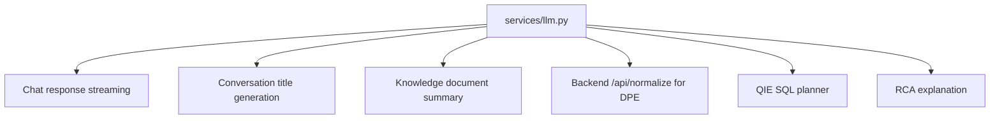
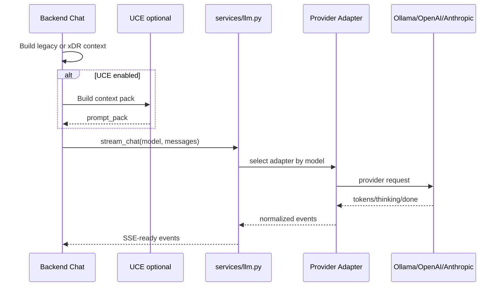
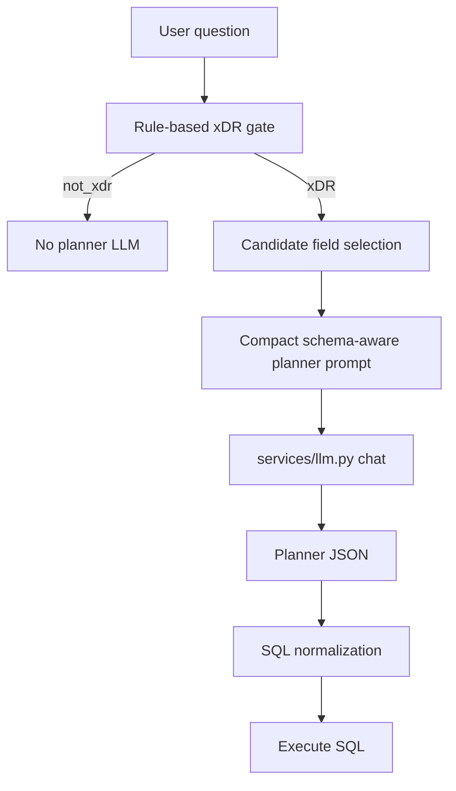
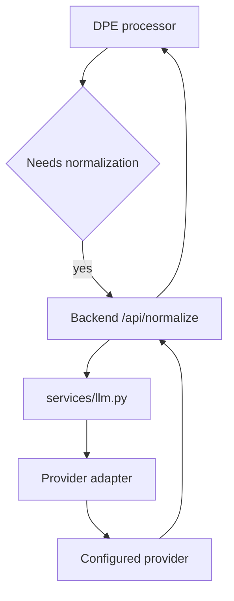

# LLM Orchestration

## Purpose

ReasonDock uses LLMs for language generation, summarization, query planning, title generation, DPE normalization, and RCA explanation. The architecture minimizes LLM use for structured investigation by using SQL, DuckDB, and deterministic rendering whenever possible.

## Responsibilities

- route backend model calls through a common LLM service
- normalize streaming and non-streaming provider behavior
- classify empty/thinking-only/length-limited responses
- apply concurrency limits
- keep QIE/DPE/RCA call sites provider-agnostic

## Current Implementation

Backend LLM calls go through:

- `backend/app/services/llm.py`
- provider adapters under `backend/app/adapters/*`

The adapter is selected by model name through `get_adapter(model)`.

`services/llm.py` exposes:

- `stream_chat(model, messages, options, timeout)`
- `chat(model, messages, options, timeout)`

It also applies concurrency limits:

- chat stream semaphore: 3
- blocking/non-stream chat semaphore: 1

## LLM Call Sites

## Internal Pipeline

## Orchestration Principles

## Important Design Decisions

- The backend owns the final LLM call.
- UCE does not call the final answer LLM.
- DPE does not call the LLM directly; it calls backend `/api/normalize`.
- QIE uses an LLM only to generate SQL plans after rule-based activation and field slimming.
- RCA uses LLM explanation only after deterministic summary and LLM gate checks.
- Simple structured aggregations should be rendered without LLM where possible.

## External Interactions

The LLM service delegates to provider adapters. Current adapter targets include Ollama and configured cloud providers. Docker Compose points the backend at `OLLAMA_BASE_URL`, which defaults to `host.docker.internal:11434` for container usage.

## Chat LLM Flow

## QIE Planner LLM Flow

## DPE Normalization Flow

## Current Implementation Status

- Ollama is the default/local model provider.
- OpenAI and Anthropic adapters exist.
- Model names are configured; backend code should not hardcode operational model names.
- QIE planner receives model from the active conversation.
- RCA uses a longer timeout and lower temperature options.

## In-Progress Refactoring

- Planner LLM should become smaller and cheaper over time because it only emits SQL plans.
- RCA explanation can remain a larger-model task because it handles reasoning narrative over structured facts.

## Future Direction

- Use small CPU-friendly models for planner tasks.
- Use direct rendering and SQL-first execution for simple statistics.
- Reserve larger models for RCA explanation, synthesis, and ambiguous reasoning.
- Keep all backend LLM calls routed through `services/llm.py`.
