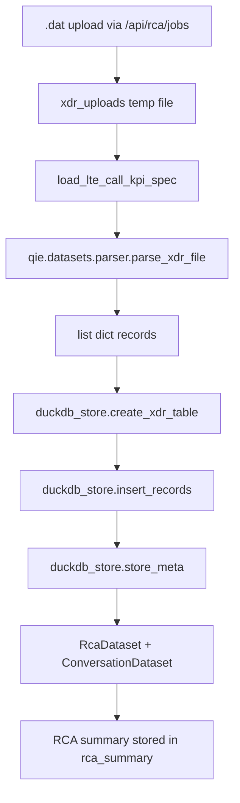
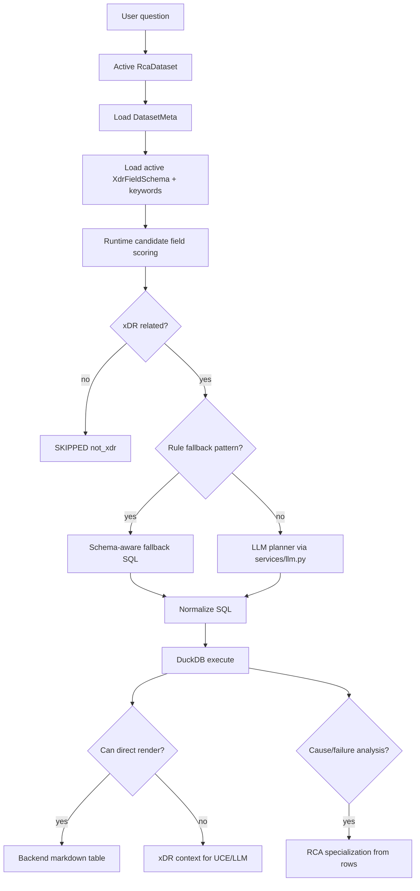
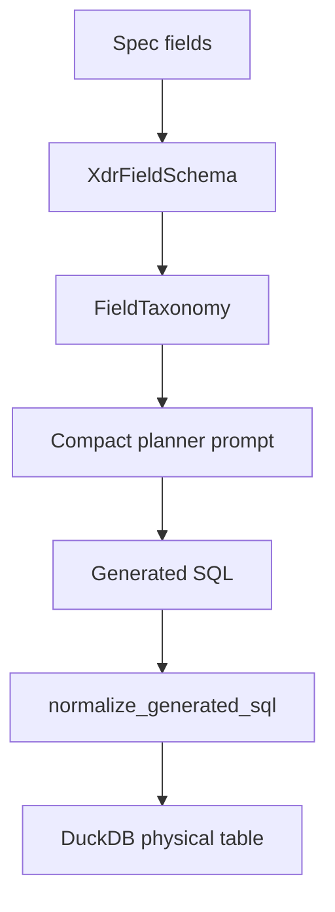

# QIE Architecture

## Purpose

QIE, the Query Investigation Engine, turns uploaded xDR files into queryable datasets and answers investigation-style natural language questions through schema-aware SQL.

It exists because structured datasets should be investigated with deterministic queries first, not by sending raw records to a large language model.

## Responsibilities

- parse `.dat` xDR files
- create DuckDB physical tables
- store and read dataset metadata
- resolve logical dataset name vs physical table name
- select candidate schema fields before planning
- generate schema-aware DuckDB SQL
- execute bounded SQL results
- render simple result sets directly as markdown
- optionally trigger RCA specialization for failure/cause analysis

## Current Implementation

Implemented modules:

- `backend/app/qie/datasets/parser.py`
- `backend/app/qie/datasets/duckdb_store.py`
- `backend/app/qie/datasets/dataset_manager.py`
- `backend/app/qie/planner/query_planner.py`
- `backend/app/qie/execution/renderer.py`
- `backend/app/qie/pipeline/investigation.py`
- `backend/app/qie/schema/spec_loader.py`

Runtime integration:

- Upload and dataset management are still exposed through `backend/app/routes/rca.py`.
- Chat-time investigation is called from `backend/app/routes/chat.py` through `run_investigation()`.
- Schema profiles and aliases are managed through `backend/app/routes/xdr_schema.py`.

## Dataset Ingestion Pipeline

## Internal Pipeline

The parser reads LTE xDR records using `\x1e` field separators and `\x1e\x1e\x1e` record separators. Large files are streamed when they exceed the configured threshold.

## Investigation Pipeline

## Query Planner

The planner is two-stage:

1. rule-based xDR relevance gate
2. LLM SQL generation only if xDR-related

Before the planner prompt is built, `run_investigation()` scores active schema fields using:

- field name
- description
- category
- role
- db type
- aliases/keywords
- query synonym expansion

Only candidate fields are passed to the planner to avoid context explosion.

## Schema-Aware SQL Model

Current storage strategy:

- DuckDB physical columns are `VARCHAR`.
- Planner `db_type` is currently storage-safe `TEXT`.
- Semantic/spec type is preserved separately as `semantic_db_type`.
- SQL literal helpers quote text values, for example `success_flag = '0'`.

## Dataset Naming Model

| Name | Example | Use |
|---|---|---|
| `dataset_id` | `LTE_CALL_KPI_R1_20260518_1100` | API and registry key |
| `dataset_name` | `LTE_CALL_KPI_R1_20260518_1100` | UI/logical display |
| `physical_table_name` | `xdr_LTE_CALL_KPI_R1_20260518_1100` | DuckDB SQL table |

The planner must use `physical_table_name` in `FROM` and `JOIN`.

## External Interactions

- MySQL stores dataset registry and conversation binding.
- DuckDB stores physical dataset tables and summary JSON.
- Backend LLM service is used for planner SQL generation.
- UCE receives xDR query results and schema hints when UCE is enabled.
- RCA may receive QIE result rows for cause/failure specialization.

## Important Design Decisions

- QIE must use `physical_table_name`, not logical dataset names, in generated SQL.
- Candidate schema field selection happens before planner LLM calls.
- DuckDB physical storage is permissive text-oriented storage; semantic field metadata is maintained separately.
- Planner output is normalized before execution and is not trusted as-is.
- Simple bounded aggregations should be rendered directly when possible.

## Current Implementation Status

- QIE modules exist and are used by chat.
- Dataset ingestion is still initiated by the RCA job flow.
- Direct rendering exists for bounded rows and selected intents.
- Rule fallback exists for common subscriber/device error statistics.
- Multi-dataset join/federation is not implemented.

## In-Progress Refactoring

- Older docs still describe QIE as planned migration from `app/rca`; code has already moved several core pieces into `app/qie`.
- Dataset upload still produces an RCA job even when the user later uses the dataset interactively.
- Some deterministic aggregation endpoints remain in `routes/rca.py`.

## Future Direction

- Make QIE the first-class dataset investigation layer independent from one-shot RCA reporting.
- Add stronger rule-based activation and small CPU-friendly planner models.
- Expand backend-side rendering for simple aggregations.
- Use larger models only for RCA reasoning and narrative explanation.
- Add multi-dataset federation and join graph generation.
