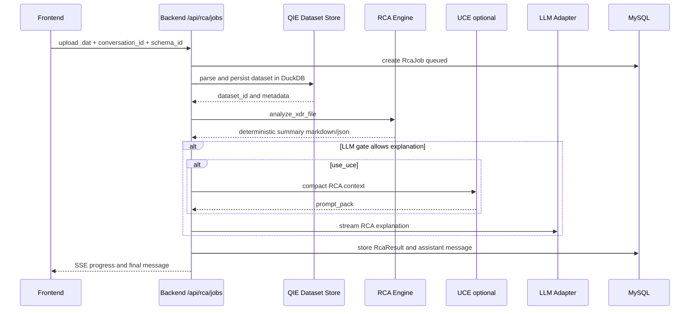
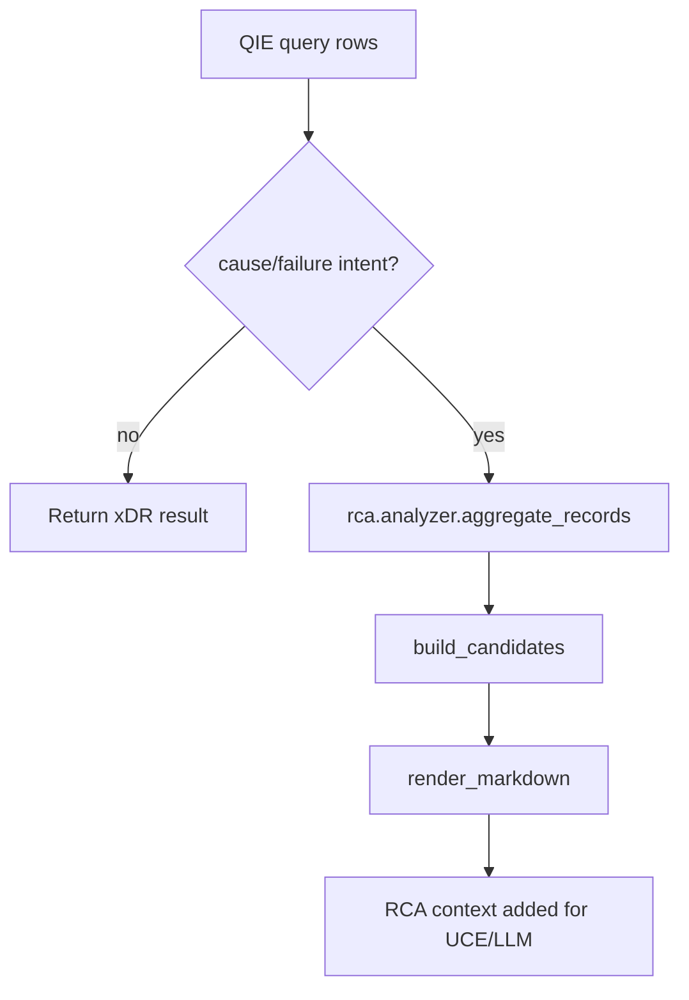

# RCA Architecture

## Purpose

The RCA Engine performs root-cause-oriented analysis for telecom xDR data. It is a specialization layer for causal reasoning and operator-facing explanation, not the primary dataset query engine.

ReasonDock's RCA philosophy is deterministic reasoning first, LLM explanation second.

## Responsibilities

- parse and summarize one-shot xDR RCA jobs
- aggregate failure/success metrics
- interpret cause/procedure dictionaries
- build RCA candidates and confidence signals
- generate structured result JSON and markdown summary
- optionally call LLM for operator-friendly explanation
- provide RCA specialization from QIE query rows when appropriate

## Current Implementation

Primary files:

- `backend/app/routes/rca.py`
- `backend/app/rca/analyzer.py`
- `backend/app/rca/pipeline.py`
- `backend/app/rca/causal.py`
- `backend/app/rca/cause_dictionary.py`
- `backend/app/rca/procedure.py`
- `backend/app/rca/evidence_graph.py`
- `backend/app/rca/confidence.py`
- `backend/app/rca/prompt_builder.py`
- `backend/app/rca/llm_gate.py`

The one-shot RCA flow remains active through `/api/rca/jobs`.

## One-Shot RCA Job Pipeline

## Internal Pipeline

## QIE-Triggered RCA Specialization

`qie/pipeline/investigation.py` calls RCA from rows when the query plan intent indicates `cause_analysis` or `failure_analysis` and rows exist.

## External Interactions

- MySQL stores jobs and results.
- DuckDB stores persisted xDR datasets and summaries.
- UCE can compress RCA context before LLM explanation.
- LLM is called through `services/llm.py`.

## Important Design Decisions

- RCA deterministic analysis runs before optional LLM explanation.
- LLM is gated and may be bypassed for healthy or already-confirmed cases.
- One-shot RCA jobs are retained for compatibility while QIE enables interactive investigation.
- RCA should consume selected facts/rows, not replace QIE dataset querying.
- Uploaded `.dat` files are deleted only after DuckDB persistence succeeds.

## Current Implementation Status

- Legacy one-shot RCA job flow is implemented and retained.
- RCA job progress streams over SSE.
- Deterministic summary is generated before LLM explanation.
- LLM call is gated by `llm_gate.should_invoke_llm`.
- QIE can trigger lightweight RCA specialization from selected query rows.

## In-Progress Refactoring

- Dataset ingestion is currently tied to `/api/rca/jobs`, even though it now serves QIE interactive investigation as well.
- RCA and QIE share domain modules and data paths; the conceptual boundary is clearer than the route boundary.

## Future Direction

- RCA should become a specialization layer on top of QIE facts.
- Simple statistics and lists should remain QIE/direct-render tasks.
- RCA should use larger or slower models only when narrative reasoning is actually needed.
- The deterministic RCA result should remain inspectable and reproducible regardless of model.
