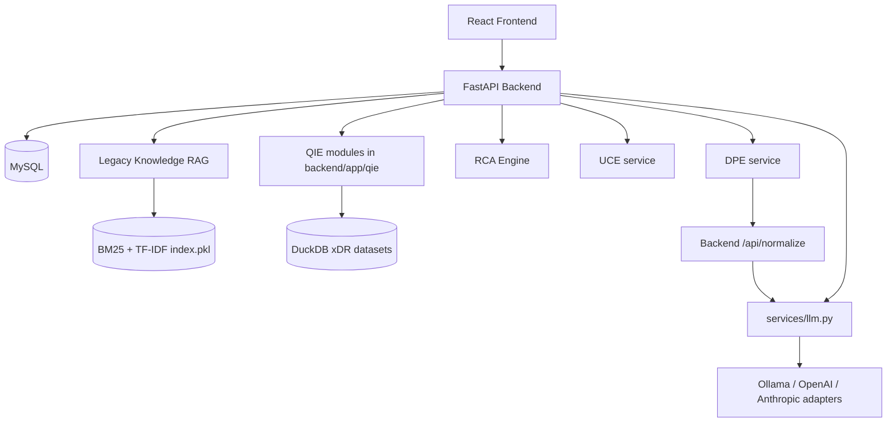
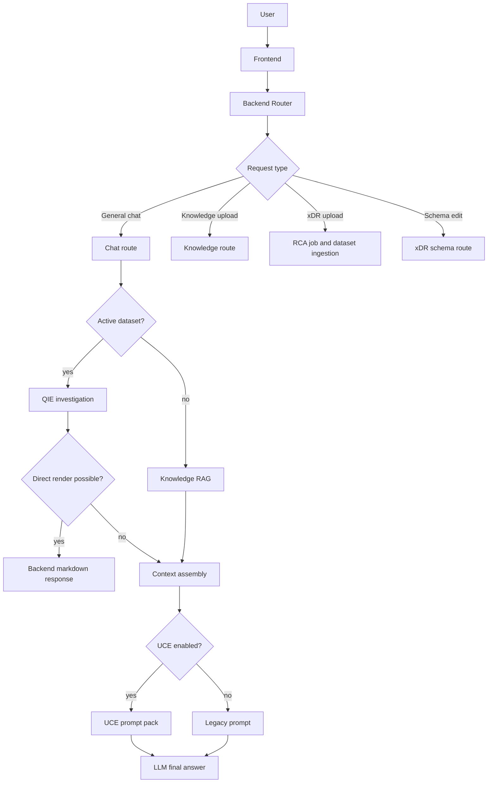
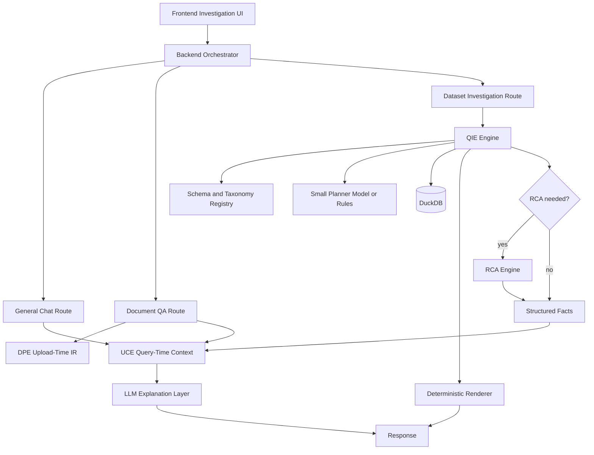

# ReasonDock Platform Overview

## Purpose

ReasonDock is evolving from a local LLM chat application into a structured investigation platform. The platform combines chat UX, document retrieval, xDR dataset investigation, context engineering, document preprocessing, deterministic RCA, and controlled LLM orchestration.

This document is the high-level map for the current system and the target direction.

## Architecture Philosophy

ReasonDock's core direction is:

```text
Use deterministic systems for facts.
Use SQL for structured data.
Use UCE for context preparation.
Use DPE for document structure.
Use RCA for causal reasoning.
Use LLMs for planning only when necessary and for explanation after facts exist.
```

The platform is intentionally moving away from "send everything to the LLM" toward structured investigation:

- xDR records are stored and queried through DuckDB.
- schema metadata guides SQL planning.
- simple statistics can be rendered directly by backend.
- RCA decides causes from structured evidence.
- LLM output becomes explanation and interface, not the source of truth.

## Current Architecture



## Engine Responsibilities

## Responsibilities

| Engine | Current role | Does not own |
|---|---|---|
| Backend Router | API, persistence, orchestration, final LLM call | engine internals as standalone services |
| QIE | dataset ingestion, SQL planning, DuckDB query, simple rendering | final narrative reasoning |
| UCE | prompt pack, state, retrieval/ranking/compression, grounding policy | storage, final LLM call |
| DPE | document structure detection and normalization IR | database, answer generation |
| RCA | deterministic causal analysis and report generation | raw dataset storage/query routing |
| LLM Service | provider abstraction and controlled calls | business routing |

## Orchestration Flow

## Internal Pipeline



## Why QIE Exists

QIE exists because xDR is structured operational data. Natural language is useful as an interface, but the actual investigation should be:

1. identify active dataset
2. select relevant fields
3. generate bounded SQL
4. execute in DuckDB
5. return rows or direct markdown
6. use LLM only if explanation is needed

This reduces hallucination, avoids context overflow, and makes results inspectable.

## Why UCE Exists

UCE exists because conversational and document context needs orchestration. It tracks active topics, rewrites implicit continuation queries for retrieval, ranks context, compresses it, and produces a structured prompt pack.

UCE improves answer quality without owning the final answer.

## Why DPE Exists

DPE exists because query-time retrieval is only as good as upload-time document structure. It detects document structure and can normalize low-confidence text into markdown-like IR, improving UCE's heading-aware retrieval.

## Why RCA Became a Specialization Layer

RCA requires causal interpretation, evidence structure, confidence separation, and operational recommendations. Those are not the same as dataset retrieval. QIE finds facts; RCA reasons over facts.

This keeps simple statistics fast and deterministic while preserving a path for deeper cause analysis.

## Current Implementation

- Frontend supports conversations, knowledge panel, xDR schema panel, RCA dataset panel, UCE toggle, debug metrics, and drag/drop `.dat` upload.
- Backend exposes chat, knowledge, RCA, schema, attachment, model, and normalize APIs.
- UCE is a separate service and is called optionally.
- DPE is a separate service and is used through manual knowledge document analysis.
- QIE is implemented as backend modules and called from chat.
- RCA one-shot job flow is still active and also creates queryable datasets.
- DuckDB stores physical xDR tables as `xdr_{dataset_id}`.
- MySQL stores application state and registry metadata.

## External Interactions

- Frontend communicates with backend via `/api`.
- Backend communicates with UCE and DPE via HTTP.
- Backend communicates with LLM providers only through `services/llm.py`.
- Backend stores xDR investigation data in DuckDB and application metadata in MySQL.
- Browser receives streaming chat and RCA progress through SSE.

## Important Design Decisions

- Structured data investigation is SQL-first.
- LLMs should not receive whole xDR datasets.
- UCE is optional and failure-tolerant.
- DPE preprocesses documents at upload/analysis time, while UCE optimizes prompt context at query time.
- RCA is a specialization layer over facts, not a generic replacement for QIE.

## In-Progress Refactoring

- QIE is partially separated but not an independent service.
- Dataset ingestion is still initiated through RCA job APIs.
- xDR schema registry is backend-route-owned while conceptually part of QIE.
- DPE has service implementation, while some older docs still describe it as pending.
- Backend and UCE both contain query rewrite logic for continuity; this should converge.

## Planned Architecture



## Future Direction

- QIE should become the standard path for structured datasets.
- Planner prompts should stay small through candidate field activation.
- Simple aggregations should bypass large LLMs.
- RCA should use stronger models only when causal explanation is required.
- DPE and UCE should share document quality metadata.
- Multi-dataset federation and join graphs can be added after single-dataset investigation stabilizes.
- Debug panels should continue exposing route decisions, selected context, generated SQL, row counts, and final prompts.
