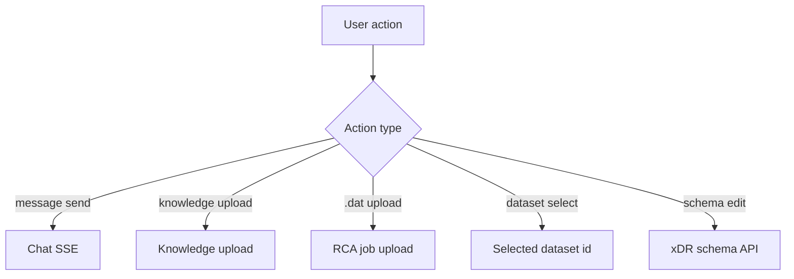
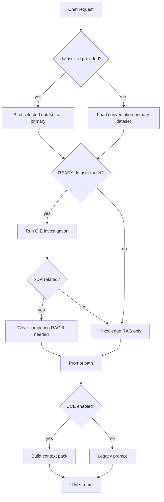
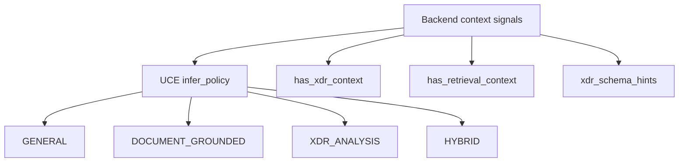

# Routing Architecture

## Purpose

Routing determines whether a user action should behave as general chat, document-grounded chat, xDR dataset investigation, direct rendered result, or RCA analysis.

ReasonDock routing is currently backend-centered. The frontend passes user selections and toggles; backend resolves datasets, retrieves documents, calls QIE/UCE, and decides whether the final LLM is needed.

## Responsibilities

- map UI actions to backend APIs
- bind selected datasets to conversations
- decide whether chat should include QIE investigation
- decide whether UCE is called for a request
- select grounding signals for UCE
- preserve legacy paths when enhanced paths are disabled or fail

## Current Implementation

Routing is primarily implemented in:

- `frontend/src/App.tsx`
- `frontend/src/hooks/useChat.ts`
- `frontend/src/hooks/useRca.ts`
- `backend/app/routes/chat.py`
- `backend/app/routes/rca.py`
- `backend/app/qie/pipeline/investigation.py`
- `uce/app/core/grounding_policy.py`

## User-Level Routing

## Internal Pipeline

## Chat Routing Flow

## Grounding Routing

UCE does not choose application route, but it chooses prompt grounding policy from backend-provided signals.

## Current Decision Rules

- If a ready dataset is explicitly selected, backend binds it to the current conversation as primary.
- If no dataset is explicitly selected, backend uses the current conversation's primary ready dataset.
- Backend intentionally does not fall back to a global dataset search.
- QIE suppresses unrelated document RAG when a query is recognized as xDR-related but planning fails.
- Direct rendering can bypass final LLM for small structured aggregations.
- UCE is optional per chat request through the frontend "enhanced prompt" toggle.

## External Interactions

- Frontend calls backend APIs and receives SSE for chat/RCA.
- Backend calls UCE only when enabled and selected for the request.
- Backend calls QIE internally when a ready dataset is active.
- Backend calls the LLM service after prompt selection unless direct rendering already produced a final response.

## Important Design Decisions

- Dataset selection is explicit and conversation-bound.
- Backend avoids global dataset fallback to prevent cross-investigation contamination.
- QIE activation happens before final prompt assembly.
- UCE does not own routing; it only receives context signals.

## In-Progress Refactoring

- Dataset routing and RCA upload flow still share `/api/rca/*`.
- Backend currently performs some continuation rewrite for knowledge retrieval before UCE also performs query rewrite.
- Routing logic is practical and explicit, but not yet isolated into a dedicated router/orchestrator module.

## Future Direction

- Make routing an explicit orchestration layer with named route outcomes:
  - `general_chat`
  - `document_grounded_chat`
  - `xdr_investigation`
  - `direct_render`
  - `rca_reasoning`
- Preserve backend ownership of final safety decisions.
- Keep UCE as prompt assembly, not route ownership.
- Keep QIE activation cheap and deterministic before planner LLM calls.
