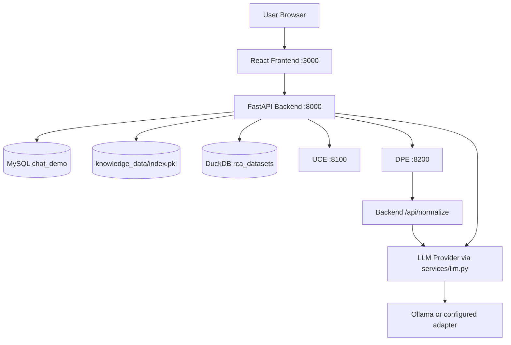
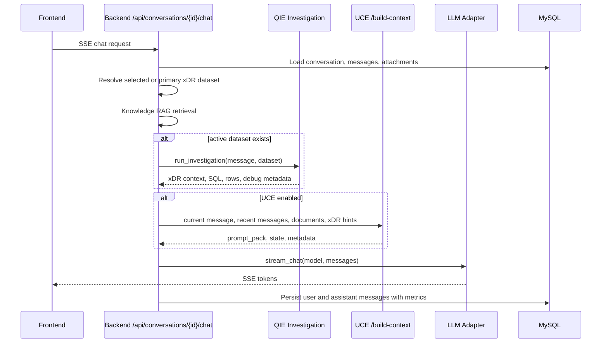

# ReasonDock System Overview

This document describes the current ReasonDock architecture as implemented in the repository. It separates shipped behavior from ongoing refactoring and planned direction.

## Purpose

ReasonDock started as an Ollama-backed chat and RAG application. It is now evolving into a structured investigation platform where unstructured chat, document retrieval, xDR dataset investigation, and RCA reasoning are orchestrated through distinct engines.

The key architectural shift is:

- from: LLM chatbot with optional RAG
- to: backend-orchestrated investigation platform with SQL-first data analysis, UCE prompt preparation, DPE document preprocessing, and RCA specialization

## Current Implementation

ReasonDock currently runs as a Docker Compose application with these services:

- `frontend`: React UI on port `3000`
- `backend`: FastAPI orchestration service on port `8000`
- `mysql`: MySQL 8.4 application database on port `3306`
- `uce`: Universal Context Engine on port `8100`
- `dpe`: Document Processing Engine on port `8200`
- external Ollama endpoint configured through `OLLAMA_BASE_URL`

The backend owns conversations, messages, attachments, knowledge documents, xDR dataset metadata, schema profiles, and RCA jobs. UCE and DPE are stateless HTTP services. DuckDB dataset storage lives behind backend QIE modules and is mounted through the `rca_datasets` Docker volume.



## Engine Boundaries

| Engine | Current location | Responsibility |
|---|---|---|
| Backend Router | `backend/app/routes/*` | API entrypoint, orchestration, persistence, SSE |
| QIE | `backend/app/qie/*` plus `routes/rca.py` and `routes/chat.py` integration | xDR dataset ingestion, schema-aware query planning, DuckDB execution |
| RCA Engine | `backend/app/rca/*` | deterministic RCA report pipeline and optional row-level RCA specialization |
| UCE | `uce/app/*` | stateless context retrieval, compression, query rewrite, prompt pack generation |
| DPE | `dpe/app/*` | upload-time structure detection, optional denoise and normalization |
| LLM Orchestration | `backend/app/services/llm.py` and adapters | model adapter selection, streaming/non-streaming calls, concurrency limits |

## Responsibilities

At the platform level, ReasonDock is responsible for keeping engine ownership clear:

- backend owns application state and orchestration
- QIE owns structured dataset investigation mechanics
- UCE owns query-time context preparation
- DPE owns upload-time document structure/normalization
- RCA owns causal reasoning over structured evidence
- LLM adapters own provider-specific calls behind one service interface

## Primary Data Flows

## Internal Pipeline

### Chat Flow



### Knowledge Document Flow

```mermaid
graph TD
  Upload[Knowledge Upload] --> BackendExtract[backend file_parser.extract_text]
  BackendExtract --> Chunk[chunker.split_text]
  Chunk --> VectorStore[vector_store index]
  BackendExtract --> Summary[generate_summary via services/llm.py]
  Summary --> KnowledgeDoc[(KnowledgeDocument)]
  KnowledgeDoc --> ManualDPE[Manual /api/knowledge/{id}/analyze]
  ManualDPE --> DPEProcess[DPE /process]
  DPEProcess --> Normalize[Backend /api/normalize when needed]
  Normalize --> LLM[services/llm.py]
  DPEProcess --> IR[(normalized_content / uce_denoised_content)]
```

### xDR Dataset Flow

```mermaid
graph TD
  DatUpload[.dat upload] --> RcaJob[/api/rca/jobs]
  RcaJob --> Parser[qie.datasets.parser]
  Parser --> DuckStore[qie.datasets.duckdb_store]
  DuckStore --> PhysicalTable["DuckDB table xdr_{dataset_id}"]
  DuckStore --> Meta["rca_dataset_meta"]
  RcaJob --> MySQLDataset["MySQL rca_datasets"]
  RcaJob --> Binding["conversation_datasets"]
  Binding --> ChatQuestion[Later chat question]
  ChatQuestion --> QIE[QIE query planning and execution]
```

## Current Implementation Status

- Chat, conversation management, attachments, knowledge store, legacy RAG, UCE integration, DPE service, xDR schema UI/API, xDR dataset upload, DuckDB storage, and QIE chat-time investigation are implemented.
- DPE is currently manual from the knowledge panel: upload stores raw chunks first, then `/api/knowledge/{doc_id}/analyze` runs DPE and stores generated IR.
- QIE modules already exist under `backend/app/qie`, although some older docs still describe migration from `app/rca` as future work.
- RCA retains the legacy one-shot `/api/rca/jobs` report flow and also exposes parts of RCA as a specialization layer inside QIE when result rows suggest failure/cause analysis.

## In-Progress Refactoring

- QIE is partially separated into `backend/app/qie`, but routing still lives in backend chat and RCA routes.
- Dataset lifecycle currently spans MySQL, DuckDB, `routes/rca.py`, and `qie/datasets/*`.
- xDR schema/taxonomy registry is implemented in backend route and ORM models, not yet fully isolated behind a QIE-specific API module.
- DPE docs still contain older "implementation pending" language, but code now exists. New architecture docs treat DPE as implemented service with manual backend integration for knowledge IR generation.

## Future Planned Architecture

## Future Direction

- QIE may become a clearer engine boundary, potentially with stronger route/module separation.
- Simple xDR statistics should increasingly bypass large LLMs through deterministic SQL plus backend rendering.
- RCA should remain a specialization layer on top of QIE facts rather than a generic LLM prompt.
- DPE and UCE can cooperate more deeply through retrieval hints, denoising, and markdown-like IR.
- Multi-dataset federation and join graph generation are planned directions but are not currently complete.

## Important Design Decisions

- SQL-first investigation avoids sending whole xDR datasets to the LLM.
- DuckDB stores xDR values permissively, while schema metadata provides semantic type and alias information.
- UCE does not own application state; backend passes previous state and stores returned metrics/state in messages.
- DPE does not own storage and does not directly call the answer LLM; it calls backend normalization when needed.
- All backend LLM calls go through `backend/app/services/llm.py`.

## External Interactions

ReasonDock integrates with:

- browser clients through the React frontend
- MySQL for application state
- DuckDB for xDR dataset tables
- Ollama or configured cloud model providers through backend adapters
- UCE and DPE through internal HTTP service calls
