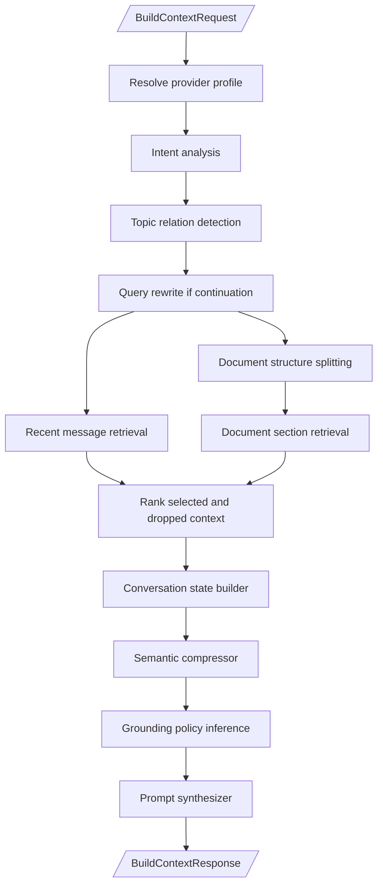
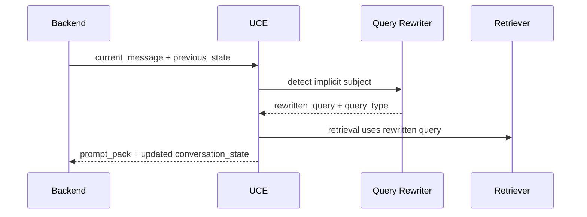
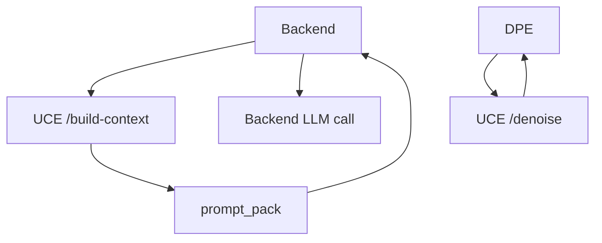

# UCE Architecture

## Purpose

UCE, the Universal Context Engine, is a stateless context preparation service. It receives current input, recent messages, optional previous state, documents, and runtime context signals, then returns a structured prompt pack for the backend to send to the LLM.

UCE exists to improve conversational continuity, context selection, compression, and prompt consistency without owning application state or directly answering users.

## Responsibilities

- intent classification
- topic relation detection
- query rewrite for continuation/ellipsis queries
- conversation state construction
- document and recent-message retrieval
- heading-aware and taxonomy-aware scoring
- context ranking and survival metadata
- semantic compression
- grounding policy inference
- prompt pack synthesis
- optional response analysis and document denoising endpoints

## Current Implementation

Service endpoints:

- `POST /build-context`
- `POST /analyze-response`
- `POST /denoise`
- `GET /health`
- `GET /status`

Core modules:

- `core/orchestrator.py`
- `core/intent.py`
- `core/topic.py`
- `core/query_rewriter.py`
- `core/state_builder.py`
- `core/structure_splitter.py`
- `core/retriever.py`
- `core/ranker.py`
- `core/compressor.py`
- `core/grounding_policy.py`
- `core/prompt_synthesizer.py`

## Pipeline

## Internal Pipeline

## Query Rewrite and Continuity

UCE tracks active topic, active entities, and topic confidence through `ConversationState`. For continuation queries such as "과정은 어때?" it can rewrite the retrieval query using previous state.

The original user question remains in the prompt. The rewritten query is for retrieval and metadata.

## Grounding Policy

`grounding_policy.py` chooses output constraints from context signals:

- `GENERAL`
- `DOCUMENT_GROUNDED`
- `XDR_ANALYSIS`
- `HYBRID`

When xDR context is present, UCE instructs the final LLM to answer only from xDR results. When document context is present without xDR, it chooses document-grounded behavior.

## External Interactions

UCE does not call the final answer LLM. It is called by backend through `services/uce_client.py`.

DPE can call UCE `/denoise` before normalization when `UCE_DENOISE_ENABLED=true`.

## Important Design Decisions

- UCE is stateless; backend owns conversation state and storage.
- UCE returns prompt packs and metadata, not final answers.
- Retrieval uses deterministic scoring and explainable metadata rather than requiring a vector database.
- Continuation query rewrite changes retrieval input, while the current user question remains visible in the prompt.
- Grounding policy is inferred from backend-provided context signals.

## Current Implementation Status

- UCE is implemented as a separate FastAPI service.
- It is stateless; backend stores returned state inside message metrics.
- It supports document chunking, heading-aware retrieval, context metadata, and queryless document compression.
- It has recently added continuation query rewrite, active topic persistence, and continuity boost.

## In-Progress Refactoring

- Backend also performs a lightweight knowledge query rewrite before UCE in `routes/chat.py`; this overlaps with UCE rewrite logic and should be treated as transitional.
- UCE grounding for xDR depends on backend-provided flags and schema hints.
- Long-term memory storage is not implemented.

## Future Direction

- Keep UCE as context assembly middleware, not an agent and not a vector database.
- Improve stateful conversational reasoning through stronger topic tracking.
- Use DPE metadata and IR quality signals for better retrieval.
- Keep debug metadata first-class so users can inspect selected and dropped context.
