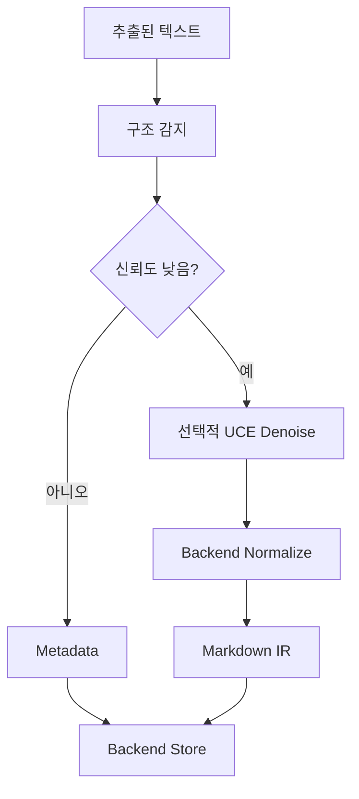

# DPE 개요

Document Processing Engine

문서를 검색 가능한 형태로 만든다.

---

# DPE가 필요한 이유

UCE는 구조화된 문서에서 더 잘 동작한다.

DPE는 약한 텍스트를 다음으로 바꾼다:

- 구조 감지 결과
- Markdown-like IR
- chunk strategy
- retrieval hints

---

# DPE의 경계

DPE가 하는 것:

- structure detection
- optional denoise
- optional normalization
- metadata 생성

DPE가 하지 않는 것:

- 문서 저장
- 사용자 답변 생성
- vector search 소유
- provider LLM 직접 호출

---

# DPE 파이프라인

---

# Normalization 목표

DPE normalization은 요약이 아니다.

해야 할 것:

- 정보 보존
- heading 추가
- entity 유지
- 시간 흐름 유지
- retrieval 용이성 개선

---

# DPE + UCE 조합

---

# 현재 / 리팩토링 / 미래

현재:

- DPE service 존재
- knowledge IR 생성은 수동 실행

리팩토링 중:

- upload-time 자동화 정책 결정 필요

미래:

- 품질 피드백
- retrieval hint boosting
- 더 풍부한 IR lifecycle
