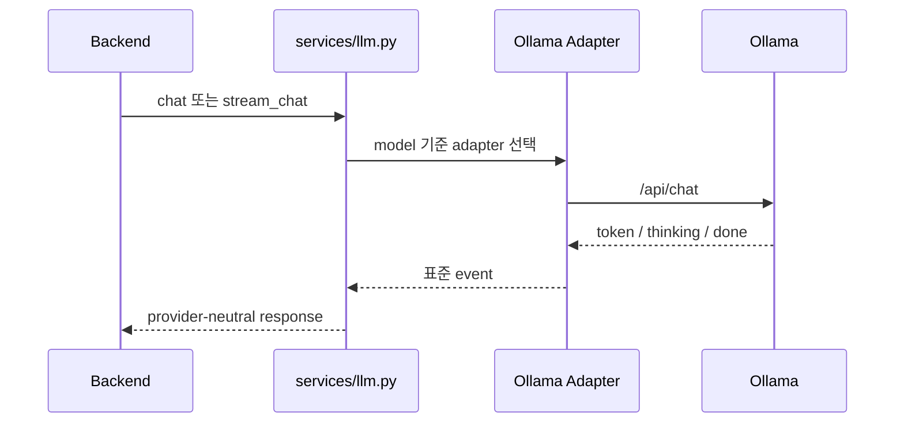
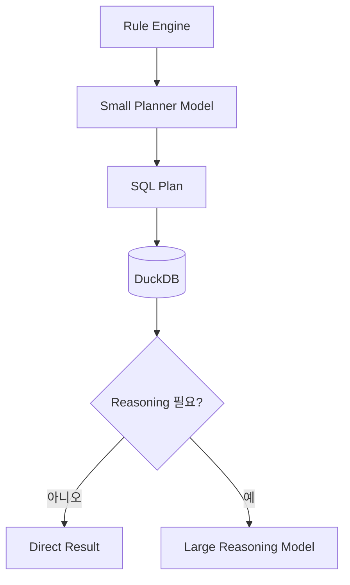
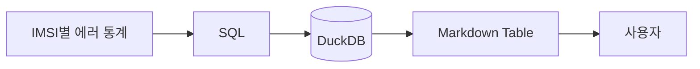

# LLM 오케스트레이션

모델은 필요한 곳에만 사용한다.

---

# 현재 LLM Service

백엔드의 모든 LLM 호출은 다음을 경유한다:

`backend/app/services/llm.py`

사용처:

- 채팅 응답
- 대화 제목 생성
- 문서 요약
- DPE normalization
- QIE planning
- RCA 설명

---

# Ollama Orchestration

---

# 모델 역할 분리

---

# 작은 Planner 모델이 가능한 이유

Planner 작업은 좁다:

- 필드 선택
- SQL JSON 출력
- schema hint 준수
- LIMIT 포함
- physical table name 사용

CPU-friendly 모델로도 가능하다.

---

# 대형 모델을 최소화해야 하는 이유

대형 모델에는 비싸다:

- raw xDR dump
- 단순 count
- Top-N 통계
- 결정적 filter

대형 모델은 다음에 사용:

- RCA 설명
- 모호한 reasoning
- 운영자용 synthesis

---

# SQL 통계는 LLM을 우회

최종 reasoning 모델이 필요 없다.

---

# LLM 호출 제어

현재:

- adapter abstraction
- streaming / non-streaming 경로
- concurrency limit
- provider error classification

미래:

- task-specific model routing
- planner model profile
- RCA model profile
