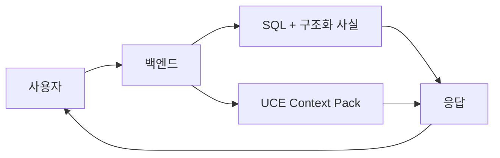

# ReasonDock 플랫폼

고수준 아키텍처 스냅샷

---

# 변화의 방향

기존:

- 채팅
- 첨부파일
- RAG
- LLM 직접 답변

확장:

- 데이터셋 조사
- 컨텍스트 오케스트레이션
- 문서 IR
- RCA 전문 분석

---

# 현재 시스템 맵

```mermaid
graph TD
  Frontend[프론트엔드] --> Backend[백엔드]
  Backend --> MySQL[(MySQL)]
  Backend --> QIE[QIE]
  Backend --> UCE[UCE]
  Backend --> DPE[DPE]
  Backend --> RCA[RCA]
  Backend --> LLM[LLM Service]
  QIE --> DuckDB[(DuckDB)]
  DPE --> Normalize[/api/normalize]
  Normalize --> LLM
```

---

# 현재 구현

- 백엔드가 상태와 라우팅을 소유
- QIE는 백엔드 내부 모듈로 구현
- UCE와 DPE는 별도 서비스
- DuckDB가 xDR 데이터셋 저장
- MySQL이 앱 상태와 registry 저장

---

# 리팩토링 중

- QIE 경계를 더 명확히 분리 중
- 데이터셋 업로드가 아직 RCA job 흐름을 사용
- schema registry는 백엔드 route에 구현
- backend와 UCE의 query rewrite 책임 정리 필요

---

# 미래 방향

- QIE를 1급 조사 엔진으로 확장
- 단순 통계는 직접 렌더링
- RCA는 원인 분석이 필요할 때만 호출
- DPE와 UCE가 더 많은 문서 메타데이터 공유
- 대형 LLM 사용 최소화

---

# 한 줄 아키텍처


