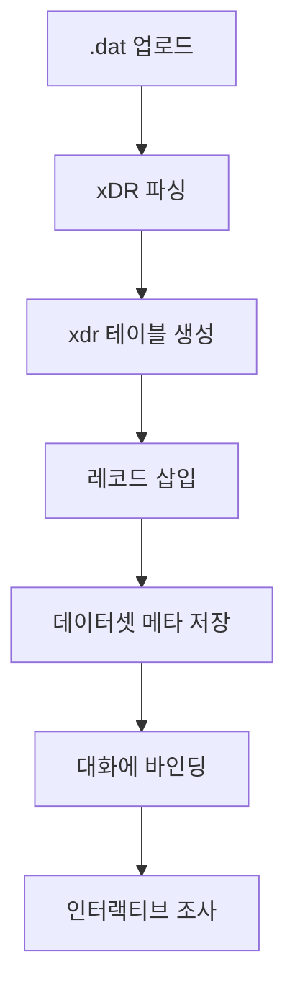
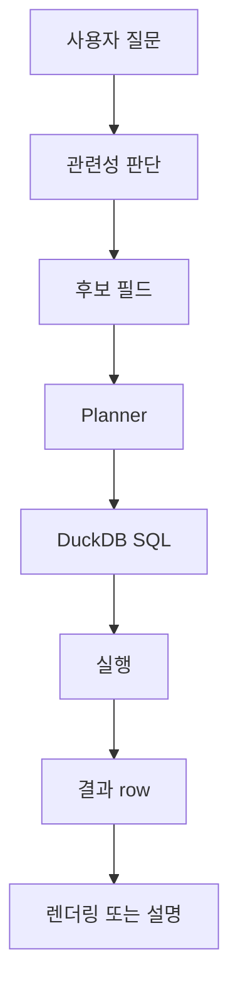
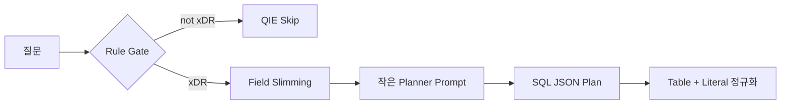
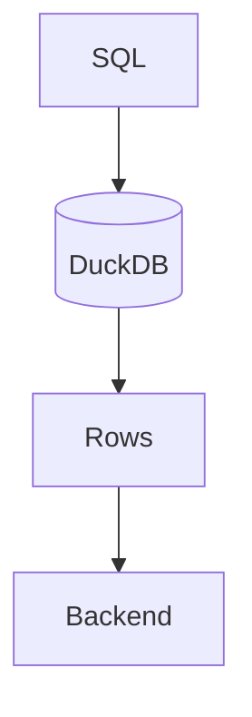
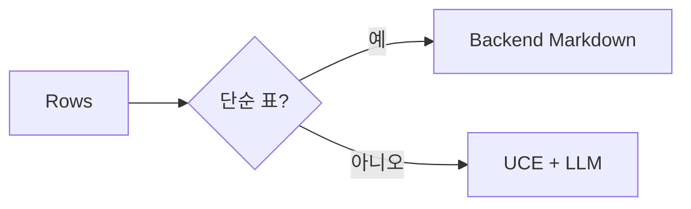
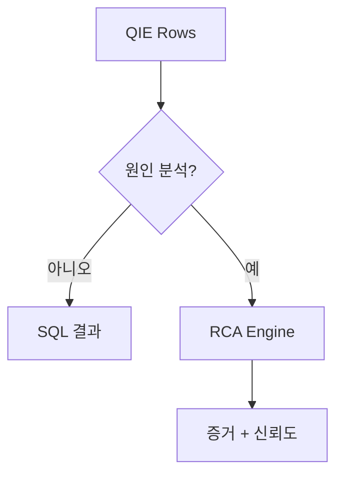

# QIE 개요

Query Investigation Engine

자연어 → SQL → 사실

---

# QIE가 필요한 이유

LLM은 데이터베이스가 아니다.

QIE가 제공하는 것:

- 구조화 데이터셋 조사
- SQL-first 답변
- DuckDB 실행
- 저비용 집계
- 필요한 경우에만 reasoning

---

# QIE의 현재 위치

현재:

- `backend/app/qie` 아래 구현
- 백엔드 chat route에서 호출
- 데이터셋 업로드는 아직 RCA job API에서 시작
- schema/taxonomy는 백엔드 route에서 관리

리팩토링 중:

- QIE route와 module 경계 정리

미래:

- 1급 조사 엔진

---

# 데이터셋 생명주기

---

# 조사 파이프라인

---

# Relevance Activation

Planner LLM 호출 전에:

- field name 매칭
- alias 매칭
- category / role 매칭
- 통신 도메인 synonym 확장
- compact candidate field 구성

결과:

Planner는 관련 schema만 본다.

---

# Planner 흐름

---

# DuckDB 실행

QIE는 DuckDB를 사용해:

- 로컬 분석 실행
- 제한된 결과 반환
- SQL-first 검증
- LLM context와 원본 데이터 분리

---

# 백엔드 직접 렌더링

단순 통계는 LLM을 우회해야 한다.

예:

- IMSI별 실패 원인
- 인터페이스별 에러 건수
- cause code Top N

---

# RCA 연계

QIE는 사실을 찾고,  
RCA는 사실 위에서 원인을 분석한다.

---

# QIE 전략

- rule engine 먼저
- small planner 다음
- DuckDB는 항상 사용
- 가능하면 direct render
- large LLM은 reasoning에만 사용
