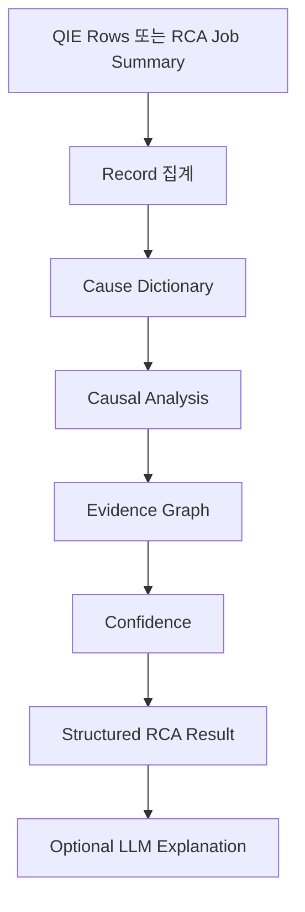
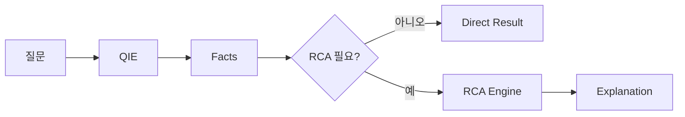

# RCA 개요

Root Cause Analysis

원인 분석 전문 계층

---

# RCA의 역할 변화

이전:

- 파일 단위 분석 흐름
- RCA report에 LLM 설명 추가

현재 방향:

- QIE가 구조화된 사실을 찾음
- RCA는 원인 분석이 필요할 때만 동작

---

# 역할 분리

| 계층 | 역할 |
|---|---|
| QIE | query, aggregate, facts |
| RCA | 원인과 증거 해석 |
| UCE | 설명용 context 준비 |
| LLM | 구조화 결과 설명 |

---

# RCA 추론 파이프라인

---

# 1회성 RCA는 유지

현재:

- `.dat` 업로드
- RCA job 생성
- parse + dataset 저장
- deterministic RCA summary
- optional LLM explanation
- SSE progress stream

---

# Interactive RCA 방향

---

# 목표 RCA 원칙

RCA가 답해야 하는 것:

- 왜 실패했는가?
- 증거 강도는 어느 정도인가?
- 가능성이 높은 root cause는 무엇인가?
- 운영자가 다음에 확인할 것은 무엇인가?

RCA가 하지 않아야 하는 것:

- 단순 count
- Top-N 통계
- raw dataset browsing
