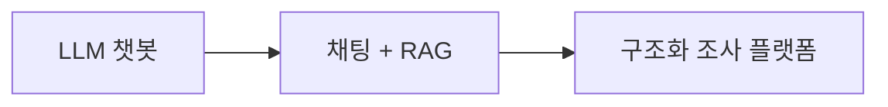
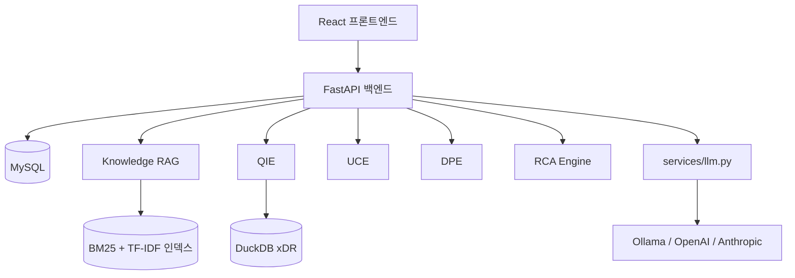
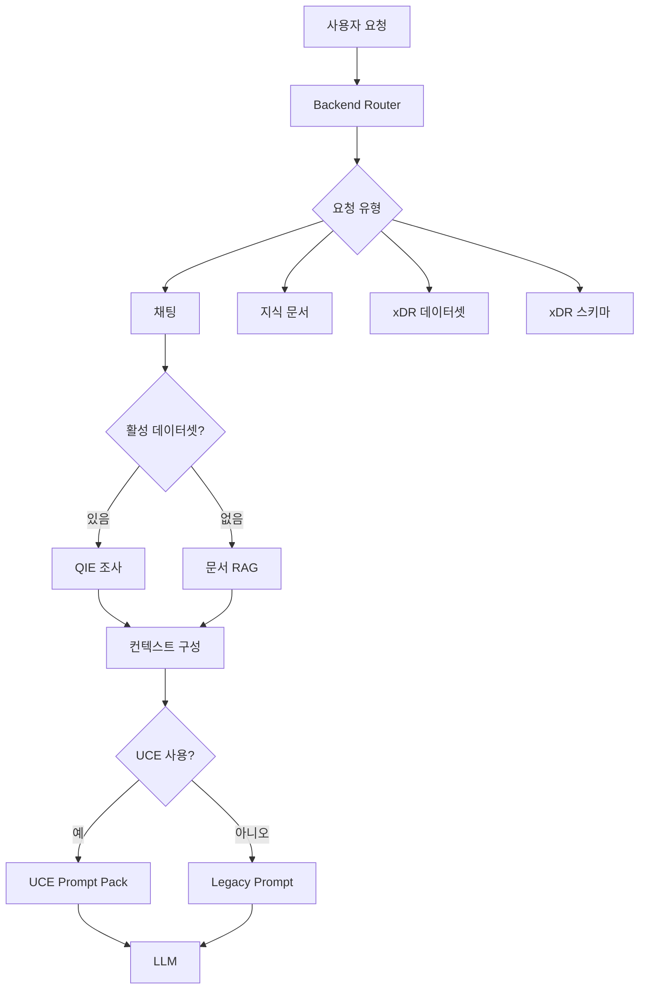
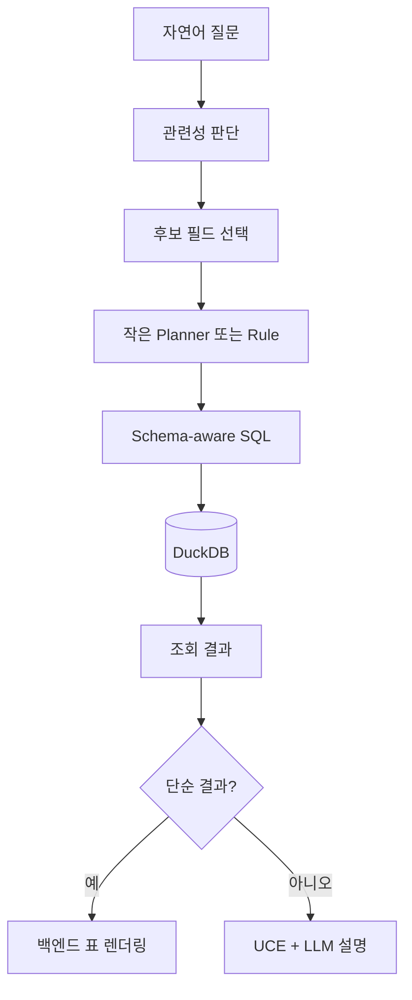
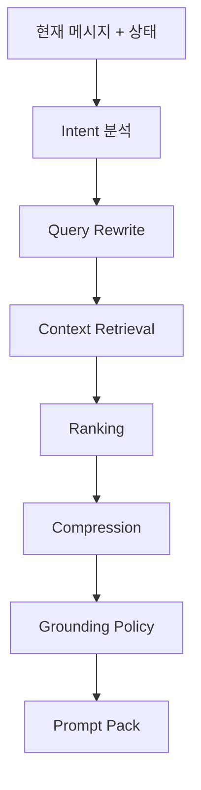
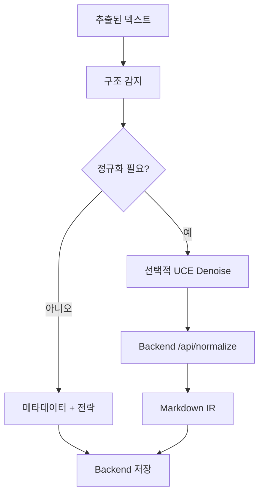
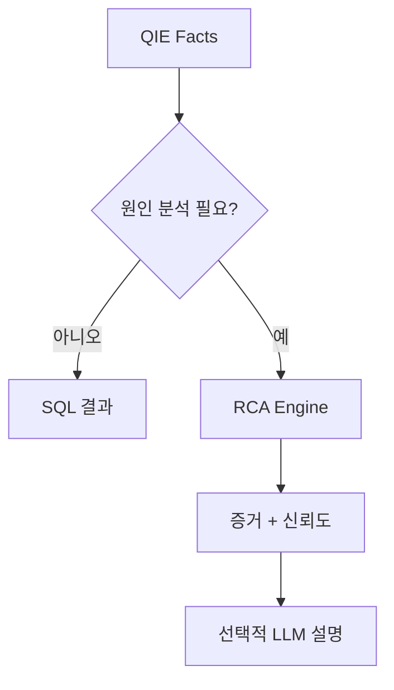
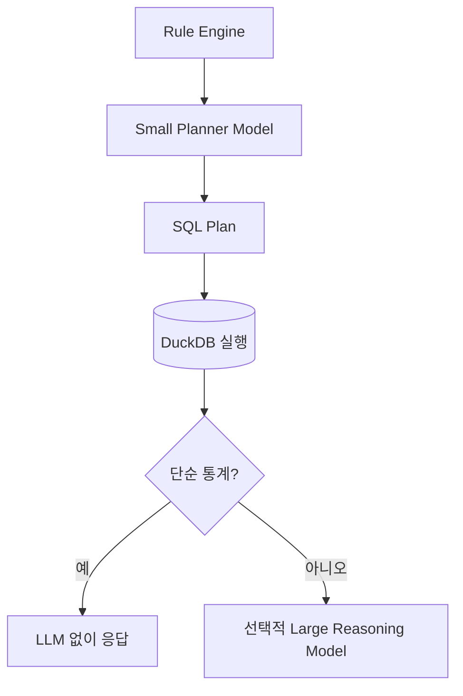
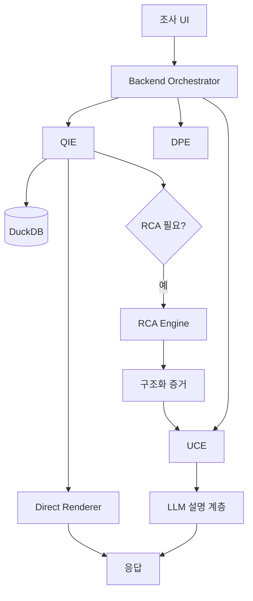

# ReasonDock 플랫폼 개요

로컬 LLM 챗봇에서  
구조화된 조사 플랫폼으로

---

# ReasonDock은 무엇이 되고 있는가

- 채팅 UX는 그대로 유지
- 구조화 데이터 조사를 1급 기능으로 확장
- 사실 확인은 SQL과 DuckDB가 담당
- LLM은 판단의 출처가 아니라 계획과 설명을 담당

---

# 아키텍처 철학

작업 성격에 맞는 엔진을 사용한다.

- 사실 확인: 결정적 로직
- 구조화 데이터: SQL + DuckDB
- 컨텍스트: UCE
- 문서 구조화: DPE
- 원인 분석: RCA
- 설명과 표현: LLM

---

# 현재 플랫폼 구조

---

# 엔진별 책임

| 엔진 | 책임 |
|---|---|
| Backend | 라우팅, 저장, 오케스트레이션 |
| QIE | 데이터셋 조사, SQL, DuckDB |
| UCE | 컨텍스트 압축, 프롬프트 구성 |
| DPE | 문서 구조 분석, Markdown IR |
| RCA | 구조화 증거 기반 원인 분석 |
| LLM | 계획 보조와 자연어 설명 |

---

# 백엔드가 전체 흐름을 조율한다

---

# QIE가 필요한 이유

구조화 데이터는 모델이 추측하면 안 된다.

- 자연어 → SQL
- DuckDB 실행
- 제한된 결과 row
- 백엔드 markdown 렌더링
- 필요한 경우에만 reasoning 수행

---

# QIE 조사 흐름

---

# UCE가 필요한 이유

LLM에는 더 많은 컨텍스트가 아니라  
더 정리된 컨텍스트가 필요하다.

- 대화 상태 추적
- 생략된 후속 질문 보강
- 관련 컨텍스트 선별
- 토큰 압축
- 구조화된 prompt pack 생성

---

# UCE 컨텍스트 파이프라인

---

# DPE가 필요한 이유

문서 검색 품질은 업로드 시점의 구조에 달려 있다.

- 문서 구조 감지
- 낮은 신뢰도 텍스트를 Markdown IR로 정규화
- 엔티티와 섹션 보존
- UCE의 heading-aware retrieval 품질 개선

---

# DPE 문서 처리 흐름

---

# RCA의 역할 변화

RCA는 더 이상 기반 계층이 아니다.

QIE가 기반이다.  
RCA는 원인 분석 전문 계층이다.

---

# LLM 오케스트레이션 전략

작업 난이도와 비용에 맞게 모델을 나눈다.

---

# 현재 / 리팩토링 / 미래

| 계층 | 현재 | 리팩토링 | 미래 |
|---|---|---|---|
| QIE | 백엔드 모듈 | 라우트 정리 | 1급 조사 엔진 |
| DPE | 서비스 + 수동 IR | 업로드 정책 결정 | 품질 피드백 |
| UCE | 선택형 미들웨어 | rewrite 책임 정리 | 더 강한 상태 추적 |
| RCA | 1회성 + 전문 분석 | QIE와 정렬 | 원인 분석 계층 |
| LLM | 공통 서비스 | 모델 역할 분리 | 대형 모델 최소화 |

---

# 목표 아키텍처

---

# 전략적 방향

- 구조화 조사는 싸고 결정적으로
- 대형 LLM에는 원본 데이터를 넣지 않기
- reasoning 전에 SQL로 사실 확인
- RCA는 count가 아니라 cause를 담당
- UCE는 모든 prompt를 의도적으로 만들기
- DPE는 문서를 검색 가능한 형태로 만들기

