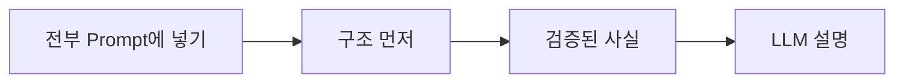
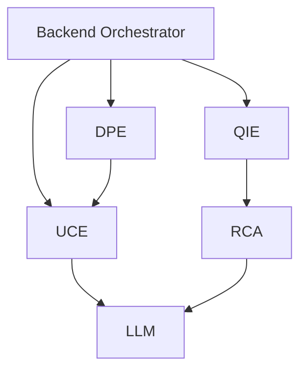
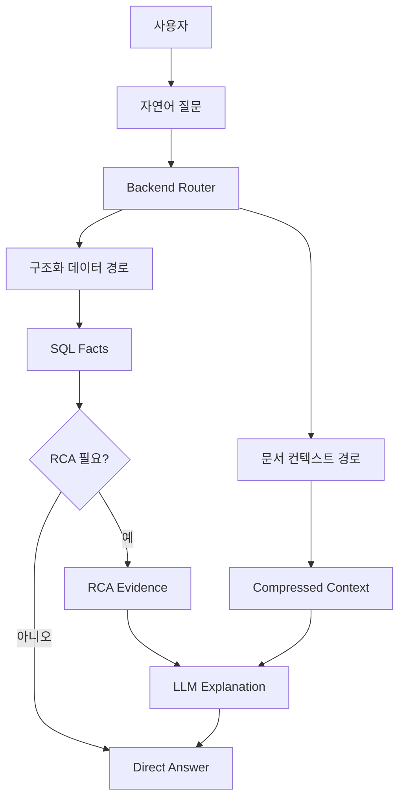

# ReasonDock 비전

LLM 인터페이스.  
결정적 조사 코어.

---

# 문제

순수 LLM 조사의 한계:

- hallucination
- context overflow
- 불안정한 reasoning
- 비싼 대형 모델 사용
- 낮은 auditability

---

# 방향

---

# 플랫폼 핵심 명제

ReasonDock이 답해야 하는 질문:

1. 어떤 데이터가 있는가?
2. 어떤 엔진이 처리해야 하는가?
3. 검증 가능한 사실은 무엇인가?
4. reasoning이 필요한가?
5. LLM은 무엇을 설명해야 하는가?

---

# 목표 엔진 모델

---

# 현재 구현

- Chat + RAG 동작
- UCE optional middleware 동작
- DPE service 존재
- QIE module 존재
- RCA job flow 존재
- DuckDB dataset investigation 동작

---

# 리팩토링 중

- QIE boundary cleanup
- dataset upload와 RCA job 분리
- schema registry ownership 정리
- query rewrite 책임 정렬
- direct rendering 확대

---

# 미래 방향

- multi-dataset investigation
- join graph generation
- small model planner
- large model RCA explanation
- 더 풍부한 debug / observability
- 발표 가능한 investigation UX

---

# 최종 상태

