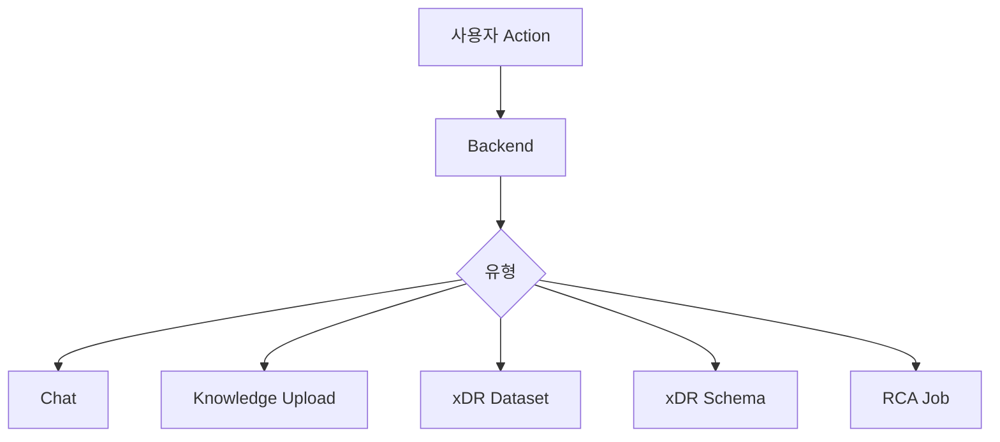
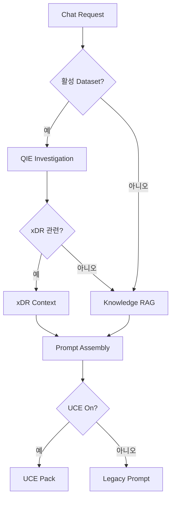
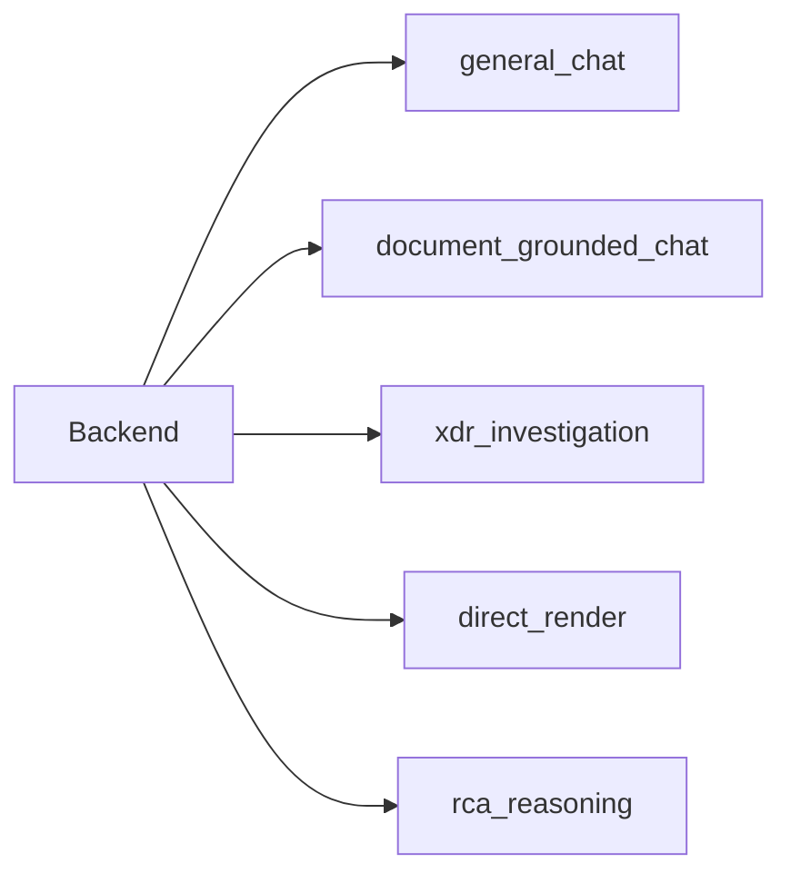

# Routing 개요

백엔드는 오케스트레이션 계층이다.

---

# Routing이 중요한 이유

같은 채팅창에서도 요청 의미는 다르다.

- 일반 질문
- 문서 QA
- xDR 조사
- SQL 직접 결과
- RCA reasoning

백엔드 routing이 이 모드를 명확히 구분한다.

---

# 현재 Routing Map

---

# Chat Routing

---

# Dataset Binding

현재 규칙:

- 명시적으로 선택한 dataset 우선
- 없으면 conversation primary dataset 사용
- global fallback 없음

이유:

- 다른 조사 데이터가 섞이는 것을 방지
- 대화 상태를 예측 가능하게 유지

---

# Routing 결과

| 결과 | 주요 경로 |
|---|---|
| 일반 채팅 | Backend → LLM |
| 문서 QA | RAG → UCE/LLM |
| xDR 조사 | QIE → DuckDB |
| 직접 결과 | QIE → renderer |
| RCA reasoning | QIE facts → RCA → LLM |

---

# 목표 Routing 구조

