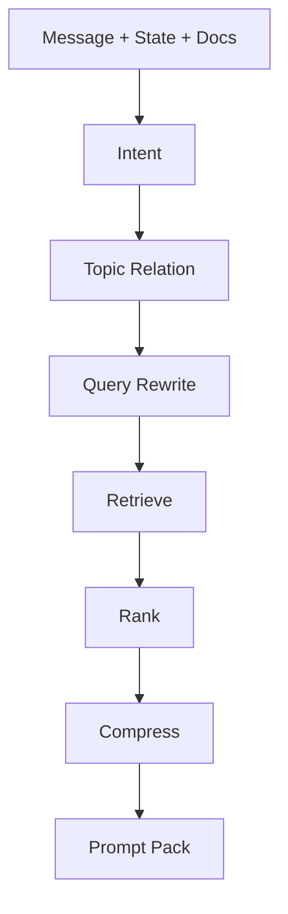
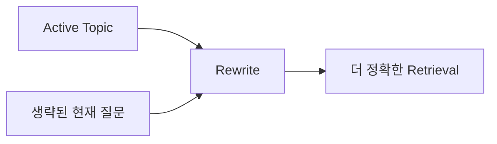
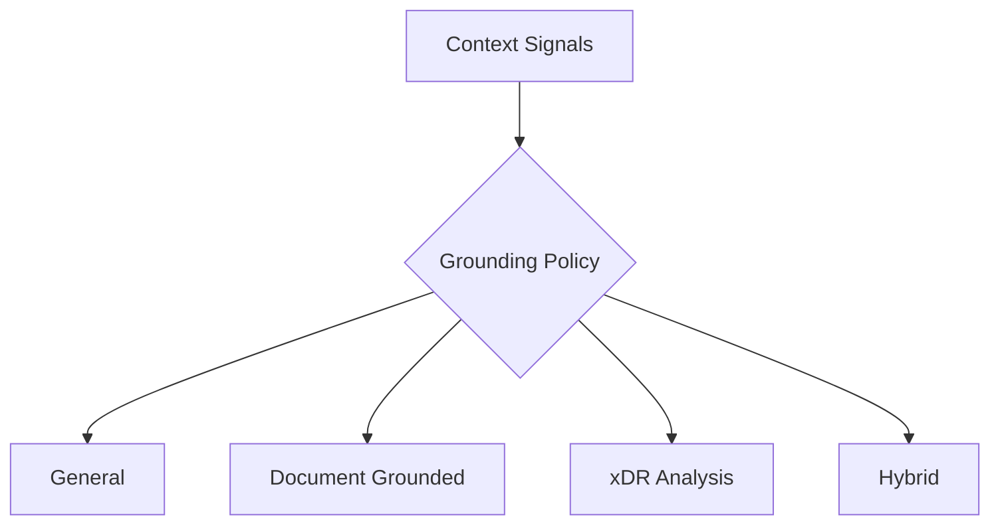

# UCE 개요

Universal Context Engine

프롬프트를 더 작고, 더 명확하고, 상태 인식 가능하게 만든다.

---

# UCE가 필요한 이유

프롬프트가 지저분하면 LLM은 맥락을 잃는다.

UCE가 제공하는 것:

- context retrieval
- conversation state
- continuation query rewrite
- ranking / compression
- grounding policy
- prompt pack synthesis

---

# UCE의 경계

UCE가 하는 것:

- 컨텍스트 준비
- prompt pack 반환
- metadata와 state 반환

UCE가 하지 않는 것:

- 대화 저장
- 최종 LLM 호출
- RAG 저장소 소유
- tool 실행

---

# UCE 파이프라인

---

# 대화 연속성 이해

예:

`협상 과정은 어때?`

retrieval 관점에서는:

`삼성전자 임금협상 협상 과정은 어때?`

---

# 압축 철학

단순히 짧게 만드는 것이 아니다.

더 잘 정리한다:

- 현재 목표
- intent
- 관련 context
- 제약사항
- 결정사항
- 사실
- 출력 요구사항

---

# Grounding Policy

---

# 현재 / 리팩토링 / 미래

현재:

- stateless service
- prompt pack 생성
- explainable metadata 제공

리팩토링 중:

- backend와 UCE의 rewrite 책임 정리

미래:

- 더 강한 topic memory
- DPE metadata 활용 강화
- retrieval diagnostics 개선
